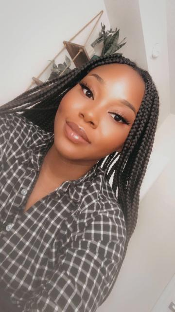
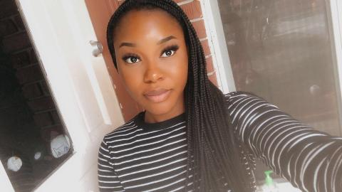
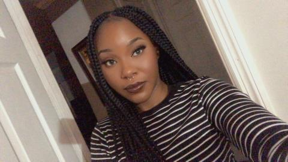

# Personalsite.io
<!DOCTYPE html>
<html>
<head>
	<meta charset="utf-8">
	<meta name="viewport" content="width=device-width, initial-scale=1">
	<title> Frandeline Petit</title>
</head>
<h1>Frandeline Petit</h1>
<h2>RN to Tech </h2>

<body>

	Hello Everyone! My name is Frandeline Petit. I am a registered nurse for almost three years now. Currently I have an interest in the computer science and plan on pursuing it. Although I know nothing about the field, I am extremely excited about submerging myself into it.    I know it won't be easy to learn but I know I am up for the challenge. I can't wait to see what I am capable of creating. 

<h3> <big>Experience </big></h3>

	 <big>University of Miami</big> 
	Cardiac Telemetry Unit  
	Jan 2022-Feb 2022  
<ul>
	<li> Record and monitor patient's vitals</li>
	<li>Collaborated with physicians and medical personels to assure patients' care plans are adhered to and adjusted as needed</li>
	<li> Delivered direct patient care, including stabilizing patients and identifying treatment options</li>
</ul>
	 

	 <big>Delray Medical Center</big>  
	Trauma Stepdown Unit  
	Mar 2021- Jan 2022 
	<ul>
		<li> Assessed and managed multiple wounds, administered medications and aided doctors in medical practice</li>
		<li>Strong understanding of pre-and post-operative patients, trauma victims and medical related illnesses</li>
		<li>Delegated tasks to appropriate nursing staff  </li>
	</ul>
	 

	  <big>Delray Medical Center </big>  
	Cardiac Telemetry Unit 
	Sept 2019-Mar 2021 
	<ul>
		<li> Adhered to HIPAA guidelines </li>
		<li>Efficient time management skills</li>
		<li>Interacted and communicated with patients and families to create a comfortable, caring environment</li>
	</ul>
	 

<h3><big>Education</big></h3> 

<big>Florida Atlantic University</big> 
Bachelor of Science in Nursing 
Aug 2015- May 2019 
 
<big>Deerfield Beach High School</big>  
High School Diploma 
Aug 2011- Jun 2015 

		<a href="Page 2.html" target="_blank"> Page 2

<big>
	Petit.Frandeline@gmail.com
	 
	West Palm Beach,FL
	 
	(754)610-0313  
	<a href="http:www.linkedin.com/in/frandeline-petit-567347229"> Linkedin Profile </a></big>

</body>
</html>
	
	
<!DOCTYPE html>
<html>
<head>
	<meta charset="utf-8">
	<meta name="viewport" content="width=device-width, initial-scale=1">
	<title> Frandeline Petit Page 2</title>
</head>
	<body>
		<h1> My Interests and I</h1>
		
		
		
		
	

	<h2>Favorite Music</h2>

	<strong>Natasha Bedingfield " Unwritten"</strong>  
	This song has been my favorite since I was a child. The way I interpret this song is that there is so much to life and that your "story" is never over.Even if things seem rough now, things can change. This song has always seem to help me put things into perspective.     

<iframe width="560" height="315" src="https://www.youtube.com/embed/b7k0a5hYnSI" title="YouTube video player" frameborder="0" allow="accelerometer; autoplay; clipboard-write; encrypted-media; gyroscope; picture-in-picture" allowfullscreen></iframe>

<

	</body>

</html>
